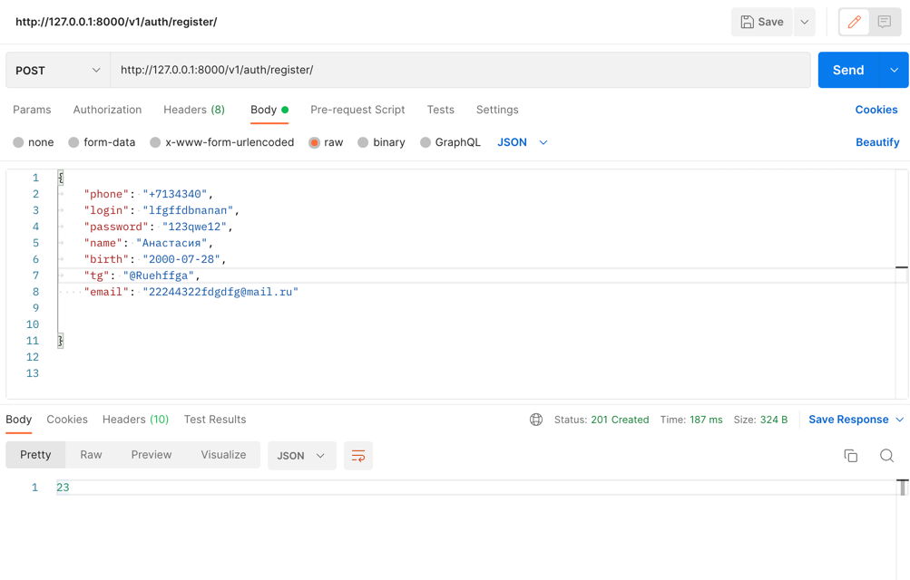
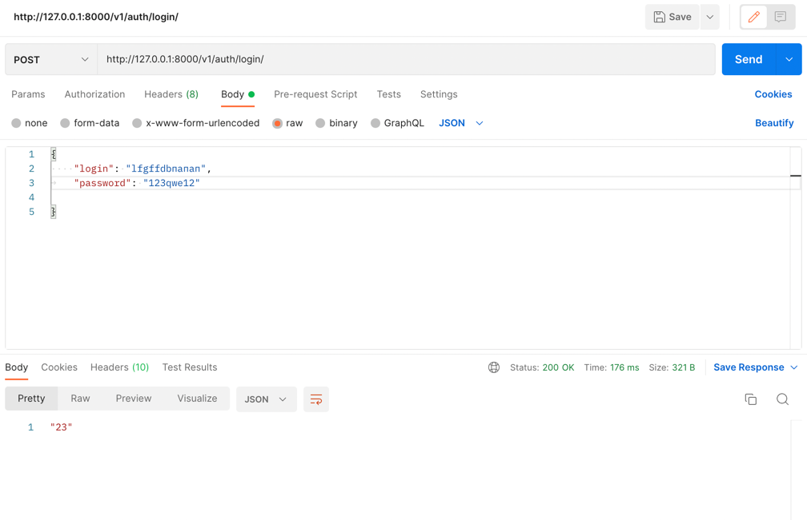
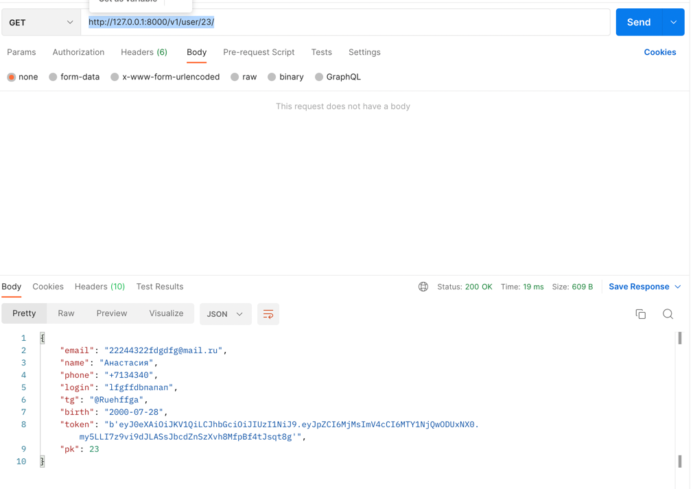

Тестовое задание для Backend-разработчиков платформы ДРУГ
Для запуска API требуется:
1) pip install -r requirements.txt
2) python manage.py makemigrations
3) python manage.py migrate
4) python manage.py runserver

БД: sqlite3.

Проверка:
C помощью программу Postman делаю GET и POST запросы:
1) Регистрация нового пользователя:
http://127.0.0.1:8000/v1/auth/register/

Получаем ответ в виде статуса 201 и Id нашего пользователя(23)
2) Вход на сайт уже зарегистрированного пользователя:
http://127.0.0.1:8000/v1/auth/login/ 

Получаем ответ в виде статуса 200 и Id нашего пользователя(23)
3) Получение информации о пользователе:
http://127.0.0.1:8000/v1/user/23/

Получаем ответ в виде статуса 200 и все поля пользователя кроме пароля